<!--
  ════════════════════════════════════════════════════════════════════════
  📌  GITHUB PROFILE README  —  Shahariar Asfaq Ovi
  ════════════════════════════════════════════════════════════════════════
  TO PUBLISH:
  1. Create a NEW public repo named EXACTLY: shahariarovi789-ux
     (same as your username — GitHub will show a "secret" special-repo note).
  2. Add a README, then paste this whole file into it.
  3. Commit. It now appears on github.com/shahariarovi789-ux automatically. 🎉
  ════════════════════════════════════════════════════════════════════════
-->

  

  💼 <strong><a href="https://linkedin.com/in/only-ovi" target="_blank">LinkedIn</a></strong> &nbsp;&bull;&nbsp; 
  ✉️ <strong><a href="mailto:shahariar.ovi789@gmail.com">Email</a></strong> &nbsp;&bull;&nbsp; 
  🌐 <strong><a href="https://shahariarovi789-ux.github.io" target="_blank">Portfolio Website</a></strong>

---

### 🧠 About Me

- 🎓 **CSE Undergrad** at the **University of Liberal Arts Bangladesh (ULAB)** (Final Semester)
- 🚀 **Backend AI Engineer Intern** at **[FlyRank AI](https://flyrank.ai/)**
- 🏆 **2× ICPC Dhaka Regionalist** (2023 & 2024) — 3+ years of competitive programming in C++
- 🤖 **Applied ML & Agentic Systems**: Specializing in LLMs, multi-agent RAG, and local PEFT/LoRA fine-tuning
- ⚽ **Hobbies**: Football, cricket, and chess

---

### 🛠️ Tech Stack & Toolkit

  

---

### 🚀 Highlighted Repositories

<table width="100%" border="0" cellpadding="6" cellspacing="0">
  <thead>
    <tr bgcolor="#161b22">
      <th align="left">Repository &amp; Description</th>
      <th align="right" width="250">Primary Tech Stack</th>
    </tr>
  </thead>
  <tbody>
    <tr>
      <td>
        <strong>🧭 <a href="https://github.com/shahariarovi789-ux/orion-agent-rag">Orion — Multi-Agent Corrective RAG (CRAG)</a></strong> 
        Multi-agent research assistant implementing the CRAG loop to eliminate LLM hallucinations. Programmed NumPy cosine similarity relevancy check (0.75 threshold).
      </td>
      <td align="right">
        <code>Python</code> · <code>Gemini API</code> · <code>NumPy</code>
      </td>
    </tr>
    <tr>
      <td>
        <strong>🎓 <a href="https://github.com/shahariarovi789-ux/roar-prompt-tutor">ROAR — Final Year Capstone Project</a></strong> 
        Adaptive prompt engineering tutor using a quantized (4-bit NF4) DeepSeek-R1 Distill Qwen-7B base model fine-tuned via PEFT/LoRA adapters.
      </td>
      <td align="right">
        <code>DeepSeek-R1</code> · <code>PEFT/LoRA</code> · <code>Gradio</code>
      </td>
    </tr>
    <tr>
      <td>
        <strong>🧠 <a href="https://github.com/shahariarovi789-ux/omeganet">OmegaNet — Neural Framework from Scratch</a></strong> 
        Modular deep learning framework built in Python using only NumPy matrix operations, implementing vectorized <em>O(N)</em> dense/dropout layers and Adam optimizer.
      </td>
      <td align="right">
        <code>Python</code> · <code>NumPy</code> · <code>Vectorized</code>
      </td>
    </tr>
    <tr>
      <td>
        <strong>👁️ <a href="https://github.com/shahariarovi789-ux/gesture-control">AeroDraw — Edge AI Gesture Controller</a></strong> 
        Client-side computer vision application enabling users to draw in the air and control interfaces via WebAssembly-based MediaPipe hand-tracking vectors at 60 FPS.
      </td>
      <td align="right">
        <code>React</code> · <code>MediaPipe</code> · <code>WebAssembly</code>
      </td>
    </tr>
  </tbody>
</table>

---

### 🏅 Achievements & Certifications

- 🥇 **ICPC Dhaka Regional Finalist** — 2024 & 2023
- 🏆 **2nd Runners-up** — Take-off Programming Contest Hosted By ULAB Computer Programming Club, 2023
- 🤗 **Foundations of Agentic AI** — Hugging Face, 2025
- 📜 **Machine Learning Specialization** — Coursera

---

  

