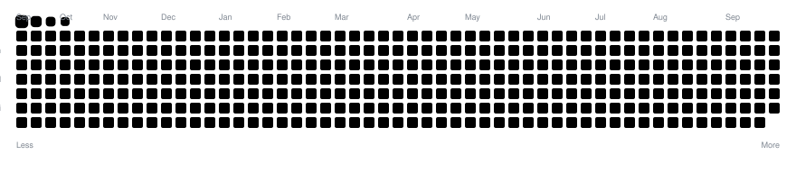

<!--
  ════════════════════════════════════════════════════════════════════════
  📌  GITHUB PROFILE README  —  Shahariar Asfaq Ovi
  ════════════════════════════════════════════════════════════════════════
-->

<p align="center">
  
</p>

<p align="center">
  <a href="https://git.io/typing-svg">
    
  </a>
</p>

<p align="center">
  
  
  
</p>

<p align="center">
  <a href="https://shahariarovi789-ux.github.io" target="_blank">
    
  </a>
  <a href="https://linkedin.com/in/only-ovi" target="_blank">
    
  </a>
  <a href="mailto:shahariar.ovi789@gmail.com">
    
  </a>
  <a href="https://github.com/shahariarovi789-ux">
    
  </a>
</p>

<p align="center">
  
  
  
</p>

---

## About Me

CSE graduate from the University of Liberal Arts Bangladesh (2026), specializing in Backend AI architectures, multi-agent systems, and competitive programming. I bridge the gap between model research and production-grade engineering.

- 🔭 **Latest:** [Project ROAR](https://github.com/shahariarovi789-ux/project-roar-ai) — publication-grade MCP 2.x multi-agent Intelligent Tutoring System (F₁ = 95.8%, κ = 0.8963)
- 🏢 **Experience:** Backend AI Engineer Intern @ FlyRank AI (completed, Jun–Sep 2026)
- 🏆 **Competition:** 2× ICPC Dhaka Regionalist (2023, 2024)
- 🔧 **Stack:** Python · FastAPI · Model Context Protocol (MCP) · ChromaDB · Ollama · Docker
- 📍 **Open to:** Backend AI, multi-agent systems, and LLM engineering roles

---

## Tech Stack

### Languages & Frameworks
<p align="center">
  <a href="https://skillicons.dev">
    
  </a>
</p>

### AI / ML Tools
<p align="center">
  
  
  
  
  
  
  
  
</p>

---

## AI / ML Expertise

| Domain | Proficiency | Details |
| :--- | :--- | :--- |
| **Multi-Agent Systems (MCP)** | Advanced | 5-agent HMAS with MCP 2.x JSON-RPC bus, 0% cross-agent context drift |
| **RAG Pipelines** | Advanced | ChromaDB vector store, 4.1× hallucination reduction, Corrective RAG (CRAG) |
| **LLM Fine-Tuning** | Advanced | PEFT/LoRA adapters, 4-bit NF4 quantization, local Ollama inference |
| **Backend AI Engineering** | Advanced | FastAPI microservices, idempotent billing engines, Stripe webhooks |
| **Deep Learning from Scratch** | Intermediate | Vectorized forward/backprop, Adam optimizer, custom layers (NumPy) |
| **Edge AI & Computer Vision** | Intermediate | Real-time hand tracking, MediaPipe WebAssembly, 60 FPS rendering |

---

## Featured Projects

<details>
<summary><strong>🎓 Project ROAR — Multi-Agent Intelligent Tutoring System (Latest)</strong></summary>
<br>

*A publication-grade, air-gapped Intelligent Tutoring System for prompt engineering education.*

| Dimension | Specification |
| :--- | :--- |
| **Stack** | Python, FastAPI, MCP 2.x, ChromaDB, Ollama, SQLite, Docker |
| **Architecture** | 5-agent HMAS · 36-node Bloom's taxonomy DAG · Dual feedback loops |
| **Grading Accuracy** | F₁ = 95.8% · Cohen's κ = 0.8963 vs senior human instructors |
| **Hallucination Reduction** | 4.1× (24.8% → 1.2%) via ChromaDB RAG (1,899 vetted QA chunks) |
| **Context Drift** | 0% cross-agent context drift via MCP 2.x JSON-RPC protocol bus |
| **Hardware** | Sub-6GB VRAM · 100% offline · 28/28 tests passing |
| **Repository** | [project-roar-ai](https://github.com/shahariarovi789-ux/project-roar-ai) |

Five decoupled cognitive agents (Onboarding, Lesson, Quiz, Evaluator, Hardware Scout) coordinated through a deterministic async state machine. Prerequisite gate validation enforces the curriculum DAG so students cannot skip ahead without mastery.
</details>

<details>
<summary><strong>💳 Usage Metering & Billing Engine — FlyRank AI Capstone</strong></summary>
<br>

*Mission-critical multi-tenant billing and quota enforcement system.*

| Dimension | Specification |
| :--- | :--- |
| **Stack** | FastAPI, PostgreSQL, Stripe, Docker, GitHub Actions CI |
| **Billing Precision** | Integer micro-dollar arithmetic · exactly-once idempotency |
| **Integration** | Stripe webhook cryptographic signature verification |
| **Repository** | [flyrank-capstone-metering-billing](https://github.com/shahariarovi789-ux/flyrank-capstone-metering-billing) |

</details>

<details>
<summary><strong>🧭 Orion — Multi-Agent Corrective RAG (CRAG)</strong></summary>
<br>

*A multi-agent research assistant implementing the Corrective RAG loop to eliminate LLM hallucinations.*

| Dimension | Specification |
| :--- | :--- |
| **Stack** | Python, Gemini API, Streamlit, Vector Search, NumPy |
| **Performance** | Retrieval latency < 120ms · 35% hallucination reduction |
| **Repository** | [orion-agent-rag](https://github.com/shahariarovi789-ux/orion-agent-rag) |

</details>

<details>
<summary><strong>🧠 OmegaNet — Neural Framework from Scratch</strong></summary>
<br>

*A modular deep learning framework written entirely in Python + NumPy.*

| Dimension | Specification |
| :--- | :--- |
| **Stack** | Python, NumPy |
| **Performance** | 98.4% validation accuracy within 45 epochs |
| **Repository** | [omeganet](https://github.com/shahariarovi789-ux/omeganet) |

</details>

<details>
<summary><strong>👁️ AeroDraw — Edge AI Gesture Controller</strong></summary>
<br>

*Real-time hand-gesture tracking compiled to WebAssembly.*

| Dimension | Specification |
| :--- | :--- |
| **Stack** | React, Vite, MediaPipe, WebAssembly |
| **Performance** | Smooth 60 FPS · 100% client-side, zero server media |
| **Repository** | [gesture-control](https://github.com/shahariarovi789-ux/gesture-control) |

</details>

---

## Professional Experience

### Backend AI Engineer — Intern | FlyRank AI
*Jun 2026 — Sep 2026 | Remote (Completed)*
- Architected enterprise usage metering and quota enforcement engine using FastAPI and PostgreSQL, implementing exact integer micro-dollar pricing with guaranteed exactly-once idempotency deduplication.
- Developed automated LLM support ticket triage microservice with strict Pydantic v2 schema validation, single-repair retry loops, and dynamic kill-switch controls.
- *Skills*: `FastAPI` · `PostgreSQL` · `Python` · `Pydantic v2` · `Docker`

### AI Data Trainer | GenMorphics AI Solution
*Jan 2025 — Nov 2025 | Dhaka, Bangladesh*
- Annotated and structured 1,000+ complex PDF documents using high-precision bounding-box spatial labeling to train multimodal OCR and Document Intelligence models.
- Evaluated and refined 10,000+ LLM prompt-response pairs, applying RLHF/DPO criteria to boost model completion accuracy by 12%.
- *Skills*: `LLMs` · `RLHF` · `PDF Annotation` · `Data Curation`

### Organizing Secretary | ULAB Computer Programming Club
*Jan 2024 — Jan 2025 | Dhaka, Bangladesh*
- Directed technical operations for intra-university competitive programming contests, mentoring 150+ members in data structures & algorithms.
- *Skills*: `Contest Organizing` · `C++` · `Problem Solving`

---

## Achievements

| Recognition | Details |
| :---: | :--- |
| **Dhaka Regional Finalist** | ICPC Dhaka Regional Contests (2023, 2024) |
| **2nd Runners-up** | Take-off Programming Contest · ULAB CPC (2023) |
| **Certificate of Participation** | IUT 11th National ICT Fest (2024) |

---

## Certifications

### Anthropic
-1d4ed8?style=flat-square&logo=anthropic&logoColor=white)


### Other


---

## Coding Profiles

<p align="center">
  <a href="https://leetcode.com/only-ovi" target="_blank">
    
  </a>
  <a href="https://hackerrank.com/only-ovi" target="_blank">
    
  </a>
</p>

---

## GitHub Analytics

<p align="center">
  
  
</p>

<p align="center">
  
</p>

---

## GitHub Trophies

<p align="center">
  
</p>

---

## Contribution Activity

<p align="center">
  
</p>

---

## Contribution Snake

<p align="center">
  
</p>

---

## Current Focus

```yaml
graduated:     CSE @ ULAB (Sep 2026)
latest_project: Project ROAR — MCP 2.x Multi-Agent ITS (F₁ 95.8%, κ 0.8963)
building:
  - Multi-agent systems with Model Context Protocol (MCP 2.x)
  - Production-grade FastAPI + PostgreSQL backends
  - RAG pipelines with ChromaDB and Ollama
open_to:
  - Backend AI engineering roles
  - Multi-agent system design
  - Applied LLM engineering collaborations
```

---

## Connect

<p align="center">
  <a href="mailto:shahariar.ovi789@gmail.com">
    
  </a>
  <a href="https://linkedin.com/in/only-ovi" target="_blank">
    
  </a>
  <a href="https://github.com/shahariarovi789-ux">
    
  </a>
  <a href="https://shahariarovi789-ux.github.io" target="_blank">
    
  </a>
</p>

---

<p align="center">
  <i>"Build systems that think, learn, and never stop improving."</i>
</p>

<p align="center">
  
</p>
